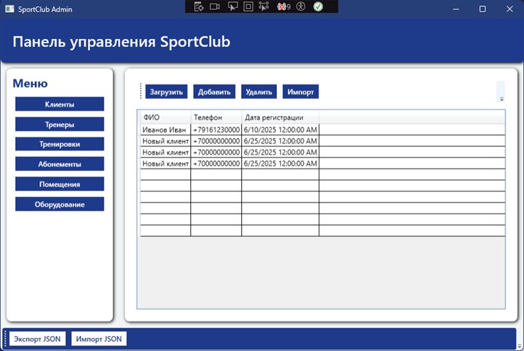
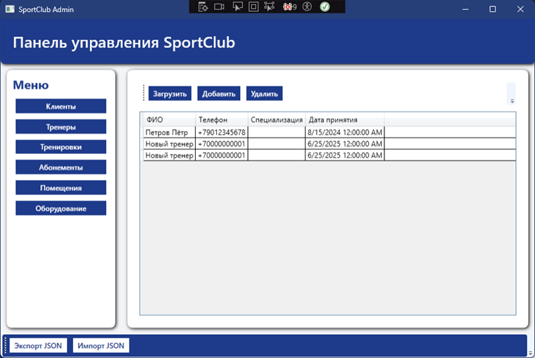
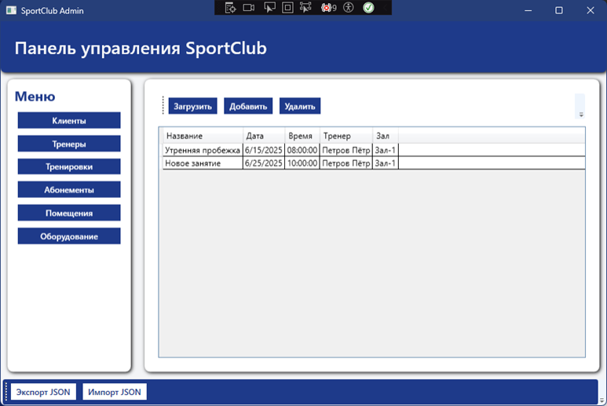
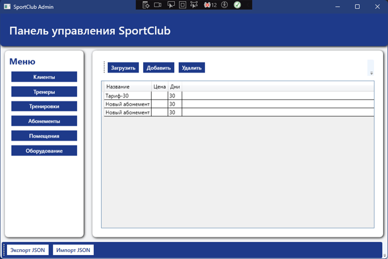
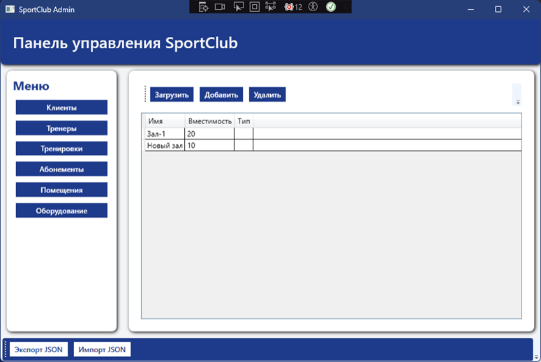

# SportApp

## Стек технологий:
- **.NET 9**
- **Entity Framework Core**
- **PostgreSQL**
- **MVVM + Repository Pattern**

## Основные функции
- Управление членами клуба
- Оформление абонементов
- Расписание тренировок
- Управление тренерами
- Управление оборудованием и залами

## Страницы приложения и их возможности

### Окно клиентов



### Окно тренеров



### Окно тренировок



### Окно абонементов



### Окно помещений



### Окно оборудований


## Используемый паттерн: Repository

### Описание:

Repository - это шаблон проектирования, который отделяет бизнес-логику от логики доступа к данным. Он действует как "прослойка" между приложением и источником данных (обычно базой данных), чтобы упростить и централизовать работу с сущностями.

Классы:

- IRepository<T>
- Repository<T>
- ViewModels (ClientsViewModel, TrainersViewModel etc.)

Диаграмма (упрощенная)

```
+------------------+           +----------------+           +---------------+
| ViewModel        | --------> | IRepository<T> | <-------- | Repository<T> |
+------------------+           +----------------+           +---------------+
```
## SOLID принципы

- S - Single Responsibility: все ViewModel отвечают только за свой слой презентации
- O - Open/Closed: новые классы ViewModel легко добавлять, не трогая старые
- L - Liskov Substitution: BaseEntityViewModel<T> можно заменить на любой наследник
- I - Interface Segregation: IRepository разделён от UI/логики
- D - Dependency Inversion: зависимости внедряются через DI

## Архитектурный шаблон: MVVM (Model-View-ViewModel)

- Model: сущности и AppDbContext (данные)
- ViewModel: ClientsViewModel, TrainersViewModel, MainViewModel и др.
- View: XAML-окна (например ClientsView.xaml)

## Архитектура
```
SportClub/
│
├── App.xaml
├── App.xaml.cs
├── MainWindow.xaml
├── MainWindow.xaml.cs
│
├── Data/
│   └── AppDbContext.cs        
│
├── Interfaces/
│   └── IRepository.cs        
│
├── Models/
│   ├── Client.cs
│   ├── Trainer.cs
│   ├── Workout.cs
│   ├── Room.cs
│   ├── Equipment.cs
│   └── Subscription.cs
│
├── Services/
│   ├── Repository.cs          
│   └── JsonService.cs        
│
├── ViewModels/
│   ├── BaseViewModel.cs
│   ├── BaseEntityViewModel.cs
│   ├── MainViewModel.cs
│   ├── ClientsViewModel.cs
│   ├── TrainersViewModel.cs
│   ├── WorkoutsViewModel.cs
│   ├── SubscriptionsViewModel.cs
│   ├── RoomsViewModel.cs
│   └── EquipmentViewModel.cs
│
└── Views/
    ├── ClientsView.xaml
    ├── TrainersView.xaml
    ├── WorkoutsView.xaml
    ├── SubscriptionsView.xaml
    ├── RoomsView.xaml
    └── EquipmentView.xaml

```
